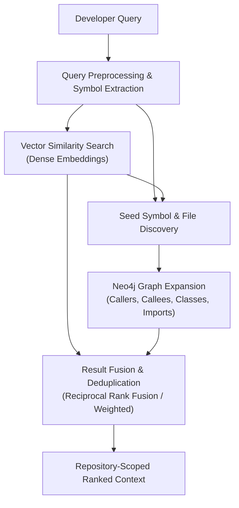
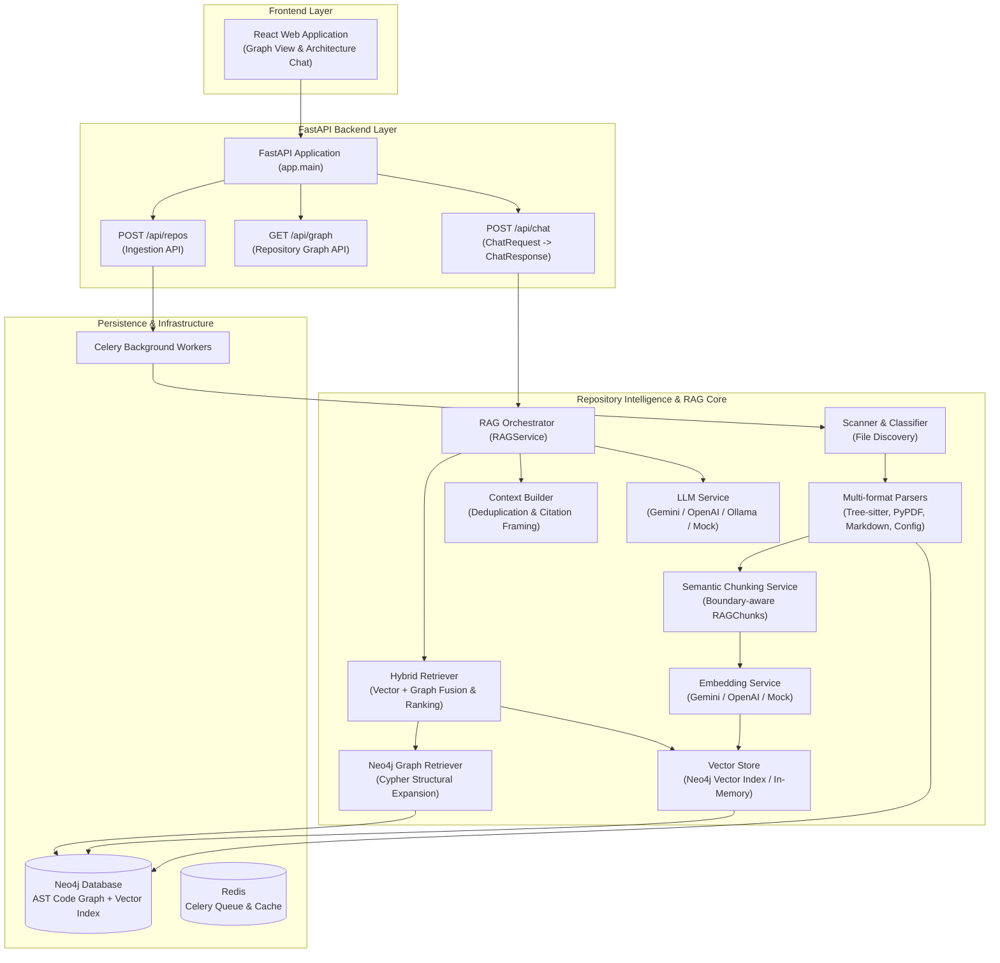

# ⚡ CodeSpec AI

### **AI-Powered Software Architecture Intelligence**

<p align="center">

**Understand. Visualize. Query. Analyze.**

Turn any software repository into a **machine-readable architecture map** using AST parsing, dependency knowledge graphs, hybrid RAG, and LLM reasoning.

<br/>


</p>

---

## 1. Overview

**CodeSpec AI** is an AI-powered software architecture intelligence system designed to analyze large, complex codebases. Understanding unfamiliar or sprawling software repositories is challenging—traditional keyword search loses structural connections, while standard Large Language Models (LLMs) hallucinate when answering questions about multi-file codebases without grounded context.

CodeSpec AI bridges this gap by combining:
- **Repository Ingestion**: Automated cloning, scanning, filtering, and multi-format document discovery.
- **AST / Code Analysis**: Polyglot Abstract Syntax Tree (AST) parsing via Tree-sitter to extract classes, functions, methods, imports, and calls across 6 programming languages.
- **Dependency & Knowledge Graph**: A Neo4j property graph representing code entities, containment hierarchies, call graphs, and structural dependencies.
- **Hybrid Retrieval-Augmented Generation (RAG)**: Dual retrieval uniting semantic vector similarity search with graph-aware traversal.
- **LLM-Based Reasoning**: Provider-agnostic generation grounded in compact, deduplicated repository context with full provenance citations.
- **Architecture Visualization**: Interactive graph exploration and technical documentation.

> **Core Philosophy**: Never ask an LLM to understand an entire codebase blindly. CodeSpec AI builds structured evidence from the repository first, then supplies targeted context to the LLM for grounded reasoning.

---

## 2. What CodeSpec AI Does

The following table summarizes the system capabilities and their current implementation status:

| Capability | Purpose | Status |
| :--- | :--- | :---: |
| 📦 **Repository Ingestion** | Git cloning, zip extraction, local filesystem scanning, and file classification | **Complete** |
| 🌳 **AST Parsing** | Grammar-based syntax parsing across 6 languages using Tree-sitter | **Complete** |
| 📐 **Structural Extraction** | Extracting functions, methods, classes, interfaces, docstrings, and line ranges | **Complete** |
| 🔗 **Dependency Analysis** | Tracking import statements, symbol dependencies, and cross-file relationships | **Complete** |
| 🕸️ **Neo4j Knowledge Graph** | Modeling codebases as property graphs (`File`, `Class`, `Function`) with Cypher queries | **Complete** |
| 🔍 **Hybrid RAG** | Vector similarity fused with Neo4j graph expansion and Reciprocal Rank Fusion | **Complete** |
| 🤖 **LLM Reasoning** | Provider-agnostic generation (Gemini, OpenAI, Ollama, Mock) with strict grounding | **Complete** |
| 💥 **Impact Analysis** | Graph traversal tracing affected callers, callees, and dependencies upon changes | **In Progress** |
| 📊 **Architecture Visualization**| Interactive frontend dependency exploration and architecture diagrams | **In Progress** |
| 📚 **Technical Documentation** | Grounded architectural Q&A with exact source file, line, and symbol citations | **Complete** |

---

## 3. RAG Pipeline

CodeSpec AI implements a comprehensive RAG pipeline specifically designed for codebases:

```text
Repository
    ↓
File Discovery & Classification
    ↓
Multi-format Parsing
├── Source Code
├── Markdown / Documentation
├── PDF
├── Plain Text
└── Configuration
    ↓
Normalized Content
    ↓
Semantic Chunking
    ↓
Embeddings
    ↓
Vector Store
    │
    └──────────────┐
                   │
Neo4j Knowledge Graph
                   │
                   ▼
            Hybrid Retrieval
                   ↓
             Result Ranking
                   ↓
            Context Builder
                   ↓
                  LLM
                   ↓
        Answer + Source References
```

### Pipeline Flow

1. **File Discovery & Classification**: Scans repository trees, respects `.gitignore` rules and default exclusions (`node_modules`, `.git`, `dist`, binaries), and classifies files into `source_code`, `markdown`, `pdf`, `configuration`, `plain_text`, or `binary`.
2. **Multi-format Parsing**: Routes each file to its specialized parser, generating normalized document models with text content, language identifiers, and structural metadata.
3. **Normalized Content**: Files are standardized into `NormalizedDocument` representations carrying repository IDs, relative paths, line offsets, and section hierarchies.
4. **Semantic Chunking**: Employs content-aware boundaries (functions, classes, markdown sections, PDF pages) rather than naive fixed-character splitting.
5. **Embeddings**: Generates dense vector embeddings for each chunk via an abstract embedding service supporting Google Gemini, OpenAI, or local/mock models.
6. **Vector Store**: Persists chunk embeddings and rich metadata in an isolated vector index scoped by `repository_id` (supporting Neo4j Vector Search or an In-Memory vector store).
7. **Neo4j Knowledge Graph**: Concurrently maintains AST nodes and relationships (`CONTAINS`, `IMPORTS`, `CALLS`, `EXTENDS`, `IMPLEMENTS`).
8. **Hybrid Retrieval**: Queries vector search for semantic proximity and expands top results through Neo4j graph traversals (discovering callers, callees, classes, and related files).
9. **Result Ranking & Fusion**: Fuses vector and graph candidates using Reciprocal Rank Fusion (RRF) or weighted scoring, eliminating duplicates and enforcing repository boundary isolation.
10. **Context Builder**: Assembles a token-budgeted, deduplicated context prompt with numbered citation markers and strict grounding rules.
11. **LLM Generation**: Synthesizes an authoritative answer with exact source citations referencing files, symbols, line ranges, and pages.

---

## 4. Multi-format Repository Processing

Software repositories contain far more than just raw source code. Understanding architecture requires analyzing design documents, configuration files, README guides, and API specifications. CodeSpec AI processes all repository artifacts through specialized parsers before normalizing them into a uniform schema:

- **Source Code**: Parsed across Python, JavaScript, TypeScript, Java, Go, and C# using Tree-sitter AST grammars. Extracts symbols, signatures, docstrings, classes, methods, and line ranges.
- **Markdown & Documentation**: Tracks heading hierarchies (`#`, `##`, `###`) to preserve logical section boundaries in README files, architectural guides, and engineering specs.
- **PDF Documents**: Extracts textual content on a per-page basis using `pypdf`, preserving 1-indexed page metadata for design specifications and architecture whitepapers.
- **Configuration Files**: Parses JSON, YAML, TOML, INI, XML, `.env`, and Dockerfiles into structured blocks, capturing dependency declarations, environment configs, and container topologies.
- **Plain Text**: Processes release notes, license files, and plain documentation with paragraph-level boundary detection.

Every parsed file produces a `NormalizedDocument` containing the normalized text, file category, line spans, structural elements, and provenance metadata.

---

## 5. Semantic Chunking

Naive fixed-character text splitting breaks code mid-statement, splits functions across chunk boundaries, and destroys documentation headings. CodeSpec AI implements **content-aware semantic chunking**:

- **Code-Aware Symbol Boundaries**: Chunks are aligned to function, method, and class definitions. Functions within size limits remain intact; oversized functions are partitioned along logical statement blocks while retaining the parent symbol header.
- **Documentation Hierarchy**: Markdown documents are segmented by heading hierarchy, ensuring that subsections retain their parent section title and context.
- **PDF Page Tracking**: PDF chunks preserve exact 1-indexed page numbers.
- **Deterministic Provenance**: Every chunk is assigned a stable, reproducible hash identifier based on `repository_id`, `file_path`, anchor symbol, and content:
  ```text
  backend/app/api/routes/chat.py:chat_query:0:a3f91c7b8e10
  ```
- **Configurable Chunking**: Governed by `ChunkingConfig`:
  - `code_chunk_size`: Maximum character threshold before splitting code blocks (default 1500 chars).
  - `code_chunk_overlap`: Line-based overlap when splitting oversized code (default 200 chars).
  - `chunk_size`: Target character threshold for text, markdown, PDF, and config chunks (default 1000 chars).
  - `chunk_overlap`: Overlap for continuity in non-code chunks (default 150 chars).
  - `min_chunk_size`: Minimum threshold to discard empty or whitespace fragments (default 20 chars).

---

## 6. Hybrid Retrieval

Codebase queries often require both **conceptual search** and **structural navigation**. Neither vector search nor graph traversal alone is sufficient:

- **Vector Retrieval**: Identifies code and documentation chunks that are semantically related to the developer's query using cosine similarity over dense vector embeddings.
- **Graph Retrieval**: Queries Neo4j Cypher to retrieve structurally connected code entities—discovering who calls a function, what classes inherit from an interface, what modules are imported, and what files share dependencies.
- **Hybrid Fusion**: Merges semantic vector hits with graph neighbors, scores them via Reciprocal Rank Fusion (RRF) or linear weighting, and deduplicates identical or subsumed line ranges.



### Illustrative Retrieval Example

For a developer querying an analyzed codebase with:
**Query**: *"How does authentication work?"*

- **Vector Retrieval**: Locates semantically relevant segments across the repository (e.g., token validation functions, security documentation sections, and authentication configuration settings).
- **Graph Retrieval**: Follows structural relationships in Neo4j to retrieve connected components (e.g., route dependencies invoking the authenticator, service classes implementing credential verification, and calling endpoints).
- **Hybrid Fusion**: Combines the semantic and structural results, ranks them using Reciprocal Rank Fusion or weighted scoring, and passes the synthesized context to the generation layer.

---

## 7. RAG + LLM Generation

Once relevant context is retrieved, CodeSpec AI synthesizes an answer using a provider-agnostic generation layer:

```text
User Query
    ↓
Hybrid Retrieval
    ↓
Context Construction (Deduplication + Token Budgeting + Provenance)
    ↓
LLM (Strict Grounding Prompt)
    ↓
Grounded Answer + Numbered Source Citations
```

### Key Principles

- **Strict Grounding**: The system prompt instructs the model to answer exclusively from the retrieved repository context. If the context is insufficient, the model explicitly declares insufficient context rather than hallucinating APIs or file paths.
- **Source Citations**: Answers reference numbered source blocks `[1]`, `[2]`, mapping directly to structured `RAGSourceItem` metadata containing repository ID, file path, symbol, line numbers, and snippets.
- **Provider-Agnostic Abstraction**: Built on `BaseLLMProvider`. Providers are instantiated via a factory based on the `LLM_PROVIDER` environment setting:
  - **Google Gemini**: Via Google GenAI API (`gemini-1.5-flash`, `gemini-1.5-pro`).
  - **OpenAI**: Via OpenAI API (`gpt-4o-mini`, `gpt-4o`).
  - **Ollama**: Local open-source inference over HTTP (`llama3`, `mistral`, `deepseek-coder`).
  - **Mock**: Deterministic offline provider for test suites and continuous integration.

---

## 8. Architecture



---

## 9. Technology Stack

| Component | Technology | Description |
| :--- | :--- | :--- |
| **Backend Framework** | FastAPI 0.111+ | High-performance asynchronous REST API with Pydantic v2 validation |
| **Server & ASGI** | Uvicorn | Asynchronous server implementation |
| **Language** | Python 3.11+ | Primary backend programming language |
| **AST Code Parsing** | Tree-sitter | Polyglot parser for Python, TypeScript, JavaScript, Java, Go, and C# |
| **Document Parsing** | PyPDF 4.0+ | PDF document extraction and page metadata indexing |
| **Graph Database** | Neo4j 5.21+ | Property graph database for AST nodes, dependencies, and Cypher queries |
| **Vector Storage** | Neo4j Vector / In-Memory | Configurable vector index for dense semantic embeddings |
| **Embedding Providers** | Gemini, OpenAI, Mock | Factory-managed embeddings via `BaseEmbeddingService` |
| **LLM Providers** | Gemini, OpenAI, Ollama, Mock | Factory-managed generation via `BaseLLMProvider` |
| **Repository Operations**| GitPython | Cloning, branch checkout, commit tracking, and tree traversal |
| **Background Tasks** | Celery 5.4+ | Asynchronous job worker for repository scanning and graph building |
| **Task Broker & Cache** | Redis 5.0+ | Message broker for Celery and caching layer |
| **Frontend** | React 18+ | Single-page architecture visualization and query interface |
| **Containerization** | Docker & Docker Compose | Multi-container orchestration (Backend, Neo4j, Redis) |
| **Test Suite** | Pytest 8.2+, HTTPX | Unit, integration, and API testing framework |

---

## 10. Project Structure

```text
CodespecAI/
├── docker-compose.yml              # Multi-container orchestration (Neo4j, Redis, Backend)
├── README.md                       # System documentation and architecture guide
├── RAG_IMPLEMENTATION_DETAILS.txt  # Implementation logs across completed RAG phases
│
├── backend/
│   ├── Dockerfile                  # Container build specification
│   ├── requirements.txt            # Python dependencies
│   ├── pytest.ini                  # Test configuration and Python path setup
│   │
│   ├── app/
│   │   ├── main.py                 # FastAPI application factory and route registration
│   │   ├── config.py               # Pydantic BaseSettings environment configuration
│   │   │
│   │   ├── api/                    # HTTP presentation layer
│   │   │   ├── deps.py             # Dependency injection providers (RAGService, Neo4j)
│   │   │   └── routes/             # REST endpoints (/chat, /repos, /graph, /impact)
│   │   │
│   │   ├── core/
│   │   │   ├── ingestion/          # Repository discovery, scanning, filtering & classification
│   │   │   ├── parser/             # Tree-sitter AST parsers for 6 programming languages
│   │   │   ├── graph/              # Neo4j graph builder and Cypher client wrappers
│   │   │   │
│   │   │   └── rag/                # End-to-end RAG subsystem
│   │   │       ├── parsers/        # Multi-format parsers (code, markdown, pdf, config, text)
│   │   │       ├── chunking/       # Semantic chunking service and configuration
│   │   │       ├── embeddings/     # Base, Gemini, OpenAI, and Mock embedding providers
│   │   │       ├── vector_store/   # Neo4j and In-Memory vector store implementations
│   │   │       ├── retrieval/      # Neo4j graph retriever & hybrid retrieval engine
│   │   │       ├── generation/     # BaseLLMProvider, ContextBuilder, RAGService, and providers
│   │   │       └── indexing_service.py # Orchestrator for embedding and vector storage
│   │   │
│   │   ├── db/
│   │   │   └── neo4j.py            # Neo4j connection lifecycle and schema constraints
│   │   │
│   │   ├── models/                 # Pydantic v2 schemas and data contracts
│   │   │   ├── chunk_models.py     # RAGChunk, ChunkingResult
│   │   │   ├── classification.py   # FileType, FileClassification
│   │   │   ├── generation_models.py# ChatRequest, ChatResponse, RAGResponse, Citations
│   │   │   ├── graph_retrieval_models.py # Graph query results and relationship models
│   │   │   ├── parser_models.py    # AST FileSummary, Function, Class, Import
│   │   │   ├── rag_models.py       # NormalizedDocument schemas
│   │   │   ├── retrieval_models.py # HybridRetrievalConfig, RetrievalResult, Provenance
│   │   │   └── vector_models.py    # VectorSearchResult, VectorFilter
│   │   │
│   │   └── workers/                # Celery background tasks for ingestion
│   │
│   ├── evaluation/                 # Offline RAG evaluation and benchmarking subsystem
│   │   ├── datasets/               # Benchmark datasets and Pydantic evaluation models
│   │   ├── retrieval/              # Hit@K, MRR, Precision, Recall evaluators
│   │   ├── generation/             # Faithfulness, context precision, answer relevance
│   │   ├── performance/            # Latency, throughput, and token cost benchmarking
│   │   ├── reports/                # Markdown and JSON evaluation report generators
│   │   └── runner.py               # CLI benchmark execution runner
│   │
│   └── tests/                      # Comprehensive backend test suite (11 test modules)
│
└── frontend/                       # React frontend application
```

---

## 11. Development Status

### Implemented & Verified

- ✅ **Repository Intelligence**: Multi-source ingestion (Git, zip, filesystem), filtering, and MIME classification.
- ✅ **Polyglot AST Parsing**: Tree-sitter parsers extracting functions, classes, methods, and imports across Python, TypeScript, JavaScript, Java, Go, and C#.
- ✅ **Neo4j Code Graph**: Graph ingestion storing AST nodes (`File`, `Class`, `Function`) and traversable relationships (`CONTAINS`, `IMPORTS`, `CALLS`, `EXTENDS`, `IMPLEMENTS`).
- ✅ **Multi-Format RAG Parsers**: Structured document parsing for source code, markdown documentation, PDF specifications, plain text, and configuration files.
- ✅ **Semantic Chunking**: Code-aware symbol boundary preservation, markdown section tracking, and deterministic provenance hashing.
- ✅ **Vector Storage & Embeddings**: Provider-agnostic embedding abstraction (Gemini, OpenAI, Mock) and dual vector storage (Neo4j Vector Index & In-Memory).
- ✅ **Graph-Aware Structural Retrieval**: Repository-scoped Cypher traversal discovering callers, callees, classes, methods, and module dependencies.
- ✅ **Hybrid Retrieval Pipeline**: Reciprocal Rank Fusion combining semantic vector similarity with structural Neo4j relationships.
- ✅ **Context Builder & Generation Layer**: Token budgeting, duplicate elimination, strict grounding prompt, and provider-agnostic LLM interface (Gemini, OpenAI, Ollama, Mock).
- ✅ **FastAPI RAG API**: API endpoint `POST /api/chat` with input validation, error handling, and structured source citations.
- ✅ **Evaluation Subsystem Code**: Benchmark models, retrieval evaluators (Hit@K, MRR), generation metric calculators, and report generators are implemented; benchmark execution across full repositories is the next milestone.

### Next Development Milestones

- 🔄 **Benchmark Execution**: Running offline evaluation benchmark suites across real-world repository datasets to measure retrieval quality (Hit@K, MRR) and generation faithfulness scores.
- 🔄 **Performance & Caching**: Multi-level query caching (Redis) for repeated retrieval queries and embedding vector cache.
- 🔄 **Local LLM Optimization**: Quantitative benchmark comparisons between local Ollama models (e.g., Llama 3, DeepSeek-Coder) and cloud providers.
- 🔄 **Deep Impact Analysis**: Multi-hop recursive impact tracing exposed through dedicated visualization endpoints.
- 🔄 **Interactive Frontend UI**: Completing the React frontend to display dynamic Neo4j graph visualizations synchronized with the RAG chat interface.

---

## 12. Testing

The backend includes a comprehensive automated test suite covering all layers of the system.

### Test Result: **147 passed, 1 warning**

```text
============================= test session starts =============================
platform win32 -- Python 3.13.5, pytest-9.1.1, pluggy-1.6.0
rootdir: CodespecAI\backend
configfile: pytest.ini
testpaths: tests
collected 147 items

tests/test_api_chat.py .............                                     [  8%]
tests/test_chunking.py ............                                      [ 17%]
tests/test_classification.py ................                            [ 27%]
tests/test_embeddings_and_vector_store.py ...........                    [ 35%]
tests/test_end_to_end_rag.py ........                                    [ 40%]
tests/test_evaluation.py ...............                                 [ 51%]
tests/test_graph_retrieval.py ................                           [ 61%]
tests/test_hybrid_retrieval.py ..........                                [ 68%]
tests/test_llm_generation.py ..............                              [ 78%]
tests/test_module1.py .....................                              [ 92%]
tests/test_rag_parsers.py ...........                                    [100%]

======================== 147 passed, 1 warning in 3.99s ========================
```

### Test Coverage Areas

1. **AST & Ingestion Parsers (`test_module1.py`)**: Tests Tree-sitter parsing across Python, JavaScript, TypeScript, Java, Go, and C#, symbol table construction, and graph builder schema generation.
2. **File Classification (`test_classification.py`)**: Tests extension mapping, boundary checks, MIME detection, and `.gitignore` path exclusions.
3. **Multi-Format Parsers (`test_rag_parsers.py`)**: Tests parsing of Python code, Markdown headers, synthetic PDF pages, YAML/JSON configs, and plain text.
4. **Semantic Chunking (`test_chunking.py`)**: Tests function/class boundary preservation, markdown section preservation, PDF page attribution, and deterministic chunk ID generation.
5. **Embeddings & Vector Store (`test_embeddings_and_vector_store.py`)**: Tests embedding batching, dimension validation, cosine similarity ranking, repository isolation, and re-indexing without duplicates.
6. **Graph-Aware Retrieval (`test_graph_retrieval.py`)**: Tests Cypher query generation, caller/callee traversal, symbol expansion, and database failure handling.
7. **Hybrid Retrieval (`test_hybrid_retrieval.py`)**: Tests seed symbol extraction, vector-graph result fusion, ranking algorithms (RRF and Weighted), and provenance preservation.
8. **LLM Generation (`test_llm_generation.py`)**: Tests provider-agnostic interface, Gemini, OpenAI, Ollama, and Mock providers, timeout handling, and token tracking.
9. **End-to-End RAG Pipeline (`test_end_to_end_rag.py`)**: Tests full orchestration from query input through retrieval, context assembly, LLM synthesis, and citation verification.
10. **FastAPI Chat Endpoint (`test_api_chat.py`)**: Tests `POST /api/chat` request validation, 200 responses, 400 bad requests, and error status mapping.
11. **Evaluation Subsystem (`test_evaluation.py`)**: Tests benchmark dataset validation, retrieval metric calculations (Hit@K, MRR, Precision, Recall), generation metrics, and report formatting.

---

## 13. Why CodeSpec AI

Traditional software exploration is manual, fragmented, and prone to error:

```text
Traditional Developer Workflow:
Search → Read Files → Trace Imports Manually → Guess Relationships → Document
```

CodeSpec AI introduces an automated, deterministic architecture intelligence workflow:

```text
CodeSpec AI Workflow:
Repository → Parse AST → Graph Dependencies + Retrieve → Reason with LLM → Understand
```

### The Core Advantage

CodeSpec AI combines **deterministic repository analysis** (AST parsing, symbol tables, and property graphs) with **semantic retrieval** and **probabilistic LLM reasoning**:

- The **AST and Neo4j Graph** provide structured, deterministic information about code entities and relationships: which functions call which methods, which classes inherit from which base types, and which modules are imported.
- The **Vector Store** captures conceptual meaning: finding code and documentation discussing topics like authentication, caching, or rate limiting even when variable names differ.
- The **Hybrid Retriever** unites these worlds, ensuring the LLM is fed exact structural and semantic evidence.
- The **LLM** acts as an intelligent reasoning and communication engine over structured facts—explaining complex architectural flows clearly with precise file and line references.

---

## 14. Roadmap

### Completed (Phases 1–9)

- [x] Repository ingestion (Git clone, zip upload, local directory scanning)
- [x] Polyglot AST parsing foundation (Tree-sitter across 6 programming languages)
- [x] Neo4j graph database schema and graph builder
- [x] Celery and Redis asynchronous background worker infrastructure
- [x] Multi-format document parsers (Source Code, Markdown, PDF, Configs, Text)
- [x] Content-aware semantic chunking with symbol boundary retention
- [x] Embedding service abstraction (Gemini, OpenAI, Mock)
- [x] Vector store abstraction (Neo4j Vector Index & In-Memory Store)
- [x] Graph-aware structural retrieval engine (Cypher queries for callers, callees, classes, imports)
- [x] Unified Hybrid Retriever (Vector similarity + Graph expansion + Reciprocal Rank Fusion)
- [x] Provider-agnostic LLM generation layer (Gemini, OpenAI, Ollama, Mock)
- [x] Context builder with strict grounding and source citation preservation
- [x] FastAPI REST endpoint `POST /api/chat` with complete validation and error handling
- [x] Comprehensive automated test suite (147 tests passed)
- [x] Offline evaluation and benchmarking subsystem implementation

### Next Milestones

- [ ] Benchmark dataset execution and quantitative quality score reporting
- [ ] Retrieval quality quantitative measurement (Hit@K, MRR, NDCG)
- [ ] Answer quality measurement (Faithfulness, Context Precision, Answer Relevance)
- [ ] Performance and latency benchmarking across vector stores and LLM providers
- [ ] Local LLM quantitative evaluation (Ollama Llama 3 / DeepSeek-Coder vs Cloud LLMs)
- [ ] Redis-backed query and embedding caching layer
- [ ] Interactive React frontend graph canvas synchronized with RAG chat interface
- [ ] Graph-based recursive impact analysis engine
- [ ] Automated architecture document and diagram generation (Mermaid/PlantUML export)
- [ ] GitHub PR impact analysis and CI/CD bot integration

---

## 🎯 Vision

CodeSpec AI is engineered as the **Software Architecture Intelligence Layer** between software engineers and their codebases:

```text
        SOURCE REPOSITORY (Code, Docs, Specs, Configs)
                             ↓
                        CodeSpec AI
             (AST + Knowledge Graph + Hybrid RAG)
                             ↓
                   STRUCTURED ARCHITECTURE
                             ↓
                  ENGINEERING INTELLIGENCE
          (Exploration, Impact Analysis, Onboarding)
```

### ⚡ Understand the Codebase. Understand the Impact.
