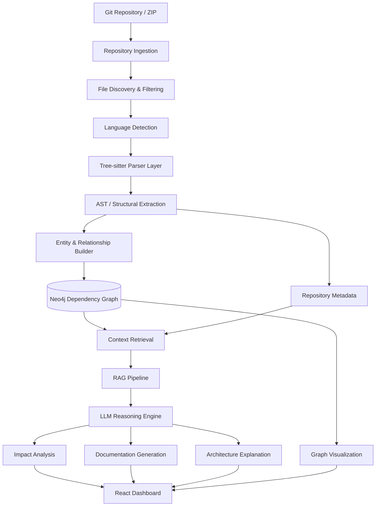

# CodeSpec AI: AI-Powered Software Architecture & Impact Analysis System


**CodeSpec AI** is an AI-powered software architecture intelligence platform designed to understand large software repositories, reconstruct their internal architecture, analyze dependencies, predict the impact of code changes, and automatically generate technical documentation.

Instead of treating a codebase as a collection of independent files, CodeSpec AI builds a **machine-readable representation of the entire software system** by combining static code analysis, Abstract Syntax Tree (AST) parsing, dependency graphs, repository intelligence, and Large Language Models (LLMs).

The platform transforms raw source code into an **interactive architectural knowledge layer** that developers can query, analyze, visualize, and use for safer software evolution.

---

## 🚀 Core Value Proposition

Modern software systems become increasingly difficult to understand as their size and dependency complexity grows.

A developer making a seemingly small change may need to understand:

* Which files depend on the modified component?
* Which functions or classes consume it?
* What modules could be indirectly affected?
* Where are the architectural bottlenecks?
* What documentation is missing?
* How does a particular feature flow through the system?
* What could break if a particular function, class, or module changes?

CodeSpec AI addresses these problems by combining **deterministic code analysis with AI-powered reasoning**.

### Core Capabilities

* **Repository Intelligence**
  Ingests complete Git repositories and analyzes their structure, files, modules, classes, functions, imports, and relationships.

* **Multi-Language AST Parsing**
  Uses Tree-sitter-based parsers to extract structural information from supported programming languages without relying solely on regular expressions.

* **Dependency Graph Construction**
  Converts extracted relationships into a graph representation using Neo4j.

* **Change Impact Analysis**
  Determines which components may be affected when a file, class, function, or dependency changes.

* **AI-Powered Architecture Understanding**
  Uses LLMs and Retrieval-Augmented Generation (RAG) to reason over repository-specific context.

* **Automatic Documentation Generation**
  Generates technical explanations for modules, components, functions, dependencies, and architectural structures.

* **Architecture Visualization**
  Converts repository relationships into visual architectural representations that developers can explore.

* **Developer-Focused Querying**
  Allows developers to ask natural-language questions about an unfamiliar codebase.

---

# 🧠 The Core Idea

Traditional code-analysis tools usually operate at only one layer.

```text
Source Code
    ↓
Static Analysis
    ↓
Reports
```

CodeSpec AI combines several layers:

```text
                    ┌─────────────────────┐
                    │   Git Repository    │
                    └──────────┬──────────┘
                               ↓
                    ┌─────────────────────┐
                    │ Repository Ingestion│
                    └──────────┬──────────┘
                               ↓
                    ┌─────────────────────┐
                    │  Source Extraction  │
                    └──────────┬──────────┘
                               ↓
                    ┌─────────────────────┐
                    │ Tree-sitter Parsing │
                    └──────────┬──────────┘
                               ↓
              ┌────────────────┴────────────────┐
              ↓                                 ↓
      Structural Metadata                 Dependencies
              ↓                                 ↓
              └────────────────┬────────────────┘
                               ↓
                    ┌─────────────────────┐
                    │   Neo4j Graph Layer │
                    └──────────┬──────────┘
                               ↓
                    ┌─────────────────────┐
                    │ Context Retrieval   │
                    │       + RAG         │
                    └──────────┬──────────┘
                               ↓
                    ┌─────────────────────┐
                    │     LLM Reasoning   │
                    └──────────┬──────────┘
                               ↓
          ┌────────────────────┼────────────────────┐
          ↓                    ↓                    ↓
    Impact Analysis      Documentation       Architecture
                                                  Graph
          └────────────────────┼────────────────────┘
                               ↓
                    ┌─────────────────────┐
                    │   React Dashboard   │
                    └─────────────────────┘
```

---

# 📊 Feature Highlights

## 1. Repository Ingestion

CodeSpec AI can accept an entire software repository rather than requiring developers to manually provide individual files.

The ingestion layer handles:

* Git repository cloning
* Repository extraction
* File discovery
* Language identification
* Workspace management
* Unsupported-file filtering
* Source-code preparation

This creates a standardized input pipeline for the analysis engine.

---

# 2. Multi-Language Code Parsing

At the heart of CodeSpec AI is a **Tree-sitter-based parsing layer**.

Rather than treating source code as plain text, CodeSpec AI converts it into structured syntax information.

For example:

```python
class UserService:

    def create_user(self, user):
        return repository.save(user)
```

The parser can identify concepts such as:

```text
Class
 └── UserService
      │
      └── Function
           └── create_user
                │
                └── Call
                     └── repository.save()
```

This structural representation allows CodeSpec AI to reason about software at a much deeper level than keyword matching.

---

# 3. Language Parser Architecture

CodeSpec AI uses a common parser abstraction so that different programming languages can be processed through a unified interface.

```text
                    Base Parser
                        │
        ┌───────────────┼───────────────┐
        ↓               ↓               ↓
 Python Parser     Java Parser     JavaScript Parser
        │
        ├── Class Extraction
        ├── Function Extraction
        ├── Import Extraction
        ├── Call Extraction
        └── Relationship Extraction
```

The architecture is designed so that additional language parsers can be added without redesigning the entire analysis pipeline.

---

# 4. Structural Code Extraction

The parser layer extracts important software entities such as:

### Files

```text
backend/
 ├── main.py
 ├── routers/
 └── services/
```

### Classes

```text
UserService
AuthService
DatabaseManager
```

### Functions

```text
create_user()
authenticate()
generate_token()
```

### Imports

```text
fastapi
database
services.auth
models.user
```

### Function Calls

```text
AuthService → DatabaseManager
UserRouter → UserService
UserService → UserRepository
```

These entities become the foundation of the dependency graph.

---

# 5. Dependency Graph Engine

One of CodeSpec AI's major differentiators is its graph-based representation of the repository.

Instead of storing relationships only as text, CodeSpec AI represents them as connected nodes and edges.

Example:

```text
┌─────────────┐
│  UserRouter │
└──────┬──────┘
       │ calls
       ↓
┌─────────────┐
│ UserService │
└──────┬──────┘
       │ calls
       ↓
┌──────────────┐
│ UserRepository│
└──────┬───────┘
       │ accesses
       ↓
┌─────────────┐
│   Database  │
└─────────────┘
```

Neo4j provides the graph storage layer for these relationships.

---

# 🔗 Dependency Intelligence

CodeSpec AI can model relationships such as:

```text
IMPORTS
CALLS
CONTAINS
DEPENDS_ON
EXTENDS
IMPLEMENTS
REFERENCES
```

This allows the system to move from:

> "Which files exist?"

to:

> "How are these files connected?"

That distinction is critical for architecture analysis.

---

# 💥 Change Impact Analysis

One of the primary objectives of CodeSpec AI is to answer:

> **"If I change this component, what else could be affected?"**

For example:

```text
Modified:
UserService.createUser()

        ↓

Direct Dependencies
        ↓

UserController
UserRouter
UserRepository

        ↓

Indirect Dependencies
        ↓

Authentication Flow
API Layer
Database Layer
```

The graph enables CodeSpec AI to traverse dependency relationships and identify potentially affected components.

---

# 🧠 AI + RAG Architecture

Static analysis tells CodeSpec AI **what exists**.

The AI layer helps explain **what it means**.

The platform combines:

```text
Repository Metadata
        +
Source Code
        +
Dependency Graph
        +
Retrieved Context
        ↓
      RAG
        ↓
       LLM
        ↓
Architecture Intelligence
```

The Retrieval-Augmented Generation layer provides repository-specific context to the LLM instead of asking the model to reason about an entire codebase blindly.

This helps ground AI responses in the actual project structure.

---

# 🤖 AI-Powered Architecture Understanding

Developers can ask questions such as:

```text
"How does authentication work in this project?"

"What files are involved when a user registers?"

"What depends on UserService?"

"Which modules are affected if this API changes?"

"Explain the architecture of the backend."

"Where is database access handled?"
```

CodeSpec AI retrieves relevant repository context before generating the response.

---

# 📚 Automatic Documentation Generation

CodeSpec AI can generate technical documentation from analyzed repository structures.

Possible documentation layers include:

### File-Level

```text
Purpose
Responsibilities
Dependencies
Exports
```

### Class-Level

```text
Class purpose
Methods
Relationships
Dependencies
```

### Function-Level

```text
Purpose
Parameters
Return value
External calls
Potential dependencies
```

### Architecture-Level

```text
Major components
Data flow
Dependency relationships
System boundaries
```

This reduces the manual effort required to understand and document legacy or unfamiliar systems.

---

# 🏗 Architecture Visualization

The dependency graph can be transformed into architectural diagrams.

Example:

```text
                  ┌───────────────┐
                  │   Frontend    │
                  └───────┬───────┘
                          │
                          ↓
                  ┌───────────────┐
                  │  API Router   │
                  └───────┬───────┘
                          │
              ┌───────────┴───────────┐
              ↓                       ↓
       ┌─────────────┐        ┌─────────────┐
       │   Service   │        │ Auth Service│
       └──────┬──────┘        └──────┬──────┘
              │                      │
              └──────────┬───────────┘
                         ↓
                  ┌─────────────┐
                  │  Database   │
                  └─────────────┘
```

The objective is to give developers an architectural view without requiring them to manually inspect hundreds of files.

---

# ⚙️ Technical Architecture



---

# 🧩 System Modules

CodeSpec AI is organized into multiple logical layers.

## Layer 1 — Repository Ingestion

Responsible for bringing source code into the system.

Typical responsibilities:

```text
Git Fetching
ZIP Extraction
Workspace Management
Repository Validation
File Discovery
```

---

## Layer 2 — Parsing Engine

Responsible for understanding source code syntax.

```text
Base Parser
Python Parser
Java Parser
JavaScript Parser
Additional Language Parsers
```

The parsers convert source code into structured entities.

---

## Layer 3 — Dependency Extraction

Responsible for discovering relationships between entities.

```text
Imports
Classes
Functions
Calls
References
Inheritance
Dependencies
```

---

## Layer 4 — Graph Construction

Responsible for storing repository relationships in Neo4j.

```text
Nodes
 ├── Repository
 ├── File
 ├── Class
 ├── Function
 └── Module

Edges
 ├── CONTAINS
 ├── IMPORTS
 ├── CALLS
 ├── DEPENDS_ON
 └── REFERENCES
```

---

## Layer 5 — AI Intelligence

Responsible for higher-level reasoning.

```text
Context Retrieval
      ↓
RAG
      ↓
LLM
      ↓
Architecture Understanding
      ↓
Impact Analysis
      ↓
Documentation
```

---

## Layer 6 — API Layer

FastAPI exposes the system capabilities to the frontend and external clients.

The API layer acts as the bridge between:

```text
Frontend
   ↓
FastAPI
   ↓
Analysis Services
   ↓
Graph + AI Infrastructure
```

---

## Layer 7 — Visualization Layer

The React frontend provides an interactive interface for:

* Repository analysis
* Architecture exploration
* Dependency visualization
* Impact analysis
* AI-generated explanations
* Documentation
* Search and exploration

---

# 📁 Project Structure

The project follows a modular backend architecture.

```text
codespec-ai/
│
├── backend/
│   │
│   ├── app/
│   │   │
│   │   ├── api/
│   │   │
│   │   ├── config/
│   │   │
│   │   ├── ingestion/
│   │   │
│   │   ├── parsers/
│   │   │   ├── base.py
│   │   │   ├── python_parser.py
│   │   │   ├── javascript_parser.py
│   │   │   └── ...
│   │   │
│   │   ├── graph/
│   │   │
│   │   ├── analysis/
│   │   │
│   │   ├── ai/
│   │   │
│   │   └── services/
│   │
│   ├── main.py
│   └── requirements.txt
│
├── frontend/
│   │
│   ├── src/
│   ├── public/
│   ├── package.json
│   └── ...
│
└── README.md
```

> The exact directory structure may evolve as additional modules are implemented.

---

# 🔄 End-to-End Processing Pipeline

When a developer submits a repository, CodeSpec AI follows a structured pipeline.

### Step 1 — Repository Submission

```text
Git URL / Repository
        ↓
Repository Ingestion
```

### Step 2 — File Discovery

```text
Repository
    ↓
Supported Files
    ↓
Language Detection
```

### Step 3 — Parsing

```text
Source Code
    ↓
Tree-sitter
    ↓
AST
```

### Step 4 — Entity Extraction

```text
AST
 ↓
Files
Classes
Functions
Imports
Calls
```

### Step 5 — Relationship Extraction

```text
Entities
   ↓
Dependency Relationships
```

### Step 6 — Graph Construction

```text
Relationships
      ↓
Neo4j
      ↓
Dependency Graph
```

### Step 7 — Context Retrieval

```text
User Query
     ↓
Relevant Files
     +
Graph Relationships
     +
Code Context
```

### Step 8 — AI Reasoning

```text
Retrieved Context
       ↓
      RAG
       ↓
      LLM
```

### Step 9 — Intelligence Output

```text
Architecture Explanation
Impact Analysis
Documentation
Dependency Information
```

### Step 10 — Visualization

```text
AI + Graph Results
        ↓
React Dashboard
```

---

# 🔍 Example: Change Impact Analysis

Suppose a developer modifies:

```text
auth_service.py
```

CodeSpec AI can trace relationships such as:

```text
auth_service.py
       │
       ├── imported by → auth_router.py
       │
       ├── called by → login_controller.py
       │
       └── used by → user_service.py
```

The graph traversal can then identify potentially affected components.

The system can present:

```text
Changed Component
        ↓
Direct Dependents
        ↓
Indirect Dependents
        ↓
Potential Impact Zone
```

The AI layer can then explain the result in natural language.

---

# 🧪 Repository Analysis Example

For a repository containing:

```text
79 supported source files
```

the ingestion and parser layers can process the repository and extract its structural information.

The resulting knowledge model can contain:

```text
Files
Classes
Functions
Imports
Calls
Dependencies
Relationships
```

This transforms a raw repository into a structured software knowledge graph.

---

# 🛠 Technology Stack

| Layer                 | Technology                     |
| --------------------- | ------------------------------ |
| Frontend              | React                          |
| Backend               | FastAPI                        |
| Language Parsing      | Tree-sitter                    |
| Graph Database        | Neo4j                          |
| AI                    | LLM + RAG                      |
| Repository Management | GitPython / Git                |
| Background Processing | Celery                         |
| Queue / Cache         | Redis                          |
| API Communication     | REST                           |
| Version Control       | Git / GitHub                   |
| Containerization      | Docker-compatible architecture |

---

# 🧠 Why Tree-sitter?

Traditional approaches often rely heavily on:

```text
Regex
+
String Matching
```

This becomes unreliable when source code becomes complex.

Tree-sitter provides syntax-aware parsing.

Instead of asking:

> "Does this file contain the word `class`?"

CodeSpec AI can reason about:

> "This node represents a class declaration containing these methods."

This makes the extraction pipeline more structured and extensible.

---

# 🕸 Why Neo4j?

Software architecture is inherently relational.

For example:

```text
Function A
    ↓ calls
Function B
    ↓ accesses
Database C
```

A graph database naturally represents these relationships.

This makes graph traversal useful for questions such as:

```text
What depends on X?

What does X depend on?

What is the shortest dependency path?

Which components are connected to X?

What could be affected by changing X?
```

---

# 🤖 Why RAG Instead of Only an LLM?

A general-purpose LLM does not automatically know the internal architecture of a user's repository.

CodeSpec AI first retrieves relevant repository context:

```text
Repository
    ↓
Parser
    ↓
Graph
    ↓
Retriever
    ↓
Relevant Context
    ↓
LLM
```

This grounds generated answers in the actual codebase.

The LLM therefore acts as the **reasoning and explanation layer**, while deterministic parsing and graph analysis provide the underlying structural evidence.

---

# 🔐 Reliability Philosophy

CodeSpec AI follows a hybrid intelligence approach.

### Deterministic Layer

Used for:

```text
Parsing
Entity Extraction
Dependency Detection
Graph Construction
Repository Structure
```

### AI Layer

Used for:

```text
Explanation
Natural Language Queries
Documentation
Architecture Summaries
Reasoning
```

This separation is intentional.

The system does not depend entirely on an LLM to understand the repository.

---

# 📡 API Architecture

The backend exposes REST APIs through FastAPI.

Example conceptual flow:

```http
POST /repository/analyze
```

Request:

```json
{
  "repository_url": "https://github.com/example/project"
}
```

Processing:

```text
Repository
    ↓
Parser
    ↓
Graph
    ↓
AI Analysis
```

Possible response:

```json
{
  "status": "success",
  "repository": "example/project",
  "files_analyzed": 79,
  "analysis": {
    "architecture": "...",
    "dependencies": [],
    "impact_analysis": []
  }
}
```

> API routes and response schemas may change as implementation progresses.

---

# 🖥 Developer Experience

CodeSpec AI is designed around a simple workflow:

```text
1. Submit Repository
        ↓
2. Analyze Codebase
        ↓
3. Explore Architecture
        ↓
4. Inspect Dependencies
        ↓
5. Ask AI Questions
        ↓
6. Analyze Changes
        ↓
7. Generate Documentation
```

The goal is to make understanding an unfamiliar repository significantly easier.

---

# 🆚 Problem vs Solution

| Traditional Development               | CodeSpec AI                           |
| ------------------------------------- | ------------------------------------- |
| Manually inspect files                | Automated repository analysis         |
| Search through code                   | Structural AST parsing                |
| Manually trace dependencies           | Dependency graph                      |
| Guess change impact                   | Graph-based impact analysis           |
| Write documentation manually          | AI-assisted documentation             |
| Read architecture diagrams separately | Generated architecture visualization  |
| Generic AI answers                    | Repository-aware RAG                  |
| Understand large projects slowly      | Centralized architecture intelligence |

---

# 🏢 Enterprise & Scalability Vision

CodeSpec AI is designed with a modular architecture so that individual layers can scale independently.

```text
                   Load Balancer
                        │
             ┌──────────┴──────────┐
             ↓                     ↓
        API Services          Worker Services
             │                     │
             └──────────┬──────────┘
                        ↓
                 Analysis Queue
                        │
              ┌─────────┴─────────┐
              ↓                   ↓
          Parser Workers      AI Workers
              │                   │
              ↓                   ↓
           Neo4j              LLM/RAG
```

Potential scaling strategies include:

* Asynchronous repository processing
* Worker-based parsing
* Redis-backed task queues
* Distributed analysis jobs
* Graph database scaling
* Cached repository metadata
* Incremental code analysis
* CI/CD integration

This allows the architecture to evolve from an academic prototype toward a larger developer-platform architecture.

---

# 💰 Cost-Effectiveness Strategy

CodeSpec AI separates expensive AI reasoning from deterministic processing.

```text
Parsing → Deterministic
Graph → Deterministic
Dependency Analysis → Deterministic

AI → Used where reasoning is required
```

This avoids unnecessarily sending the entire repository to an LLM.

Instead:

```text
User Query
    ↓
Relevant Context Retrieval
    ↓
Small Context
    ↓
LLM
```

This approach can reduce unnecessary token consumption while keeping the AI layer focused on tasks where it provides the most value.

---

# 🔮 Future Intelligence Capabilities

The architecture can be extended toward:

* Predictive change-risk analysis
* Code smell detection
* Architecture drift detection
* Technical debt analysis
* Automated pull-request impact analysis
* CI/CD integration
* GitHub pull-request analysis
* Repository version comparison
* Multi-repository dependency analysis
* Team-level architecture analytics
* Automated architecture documentation
* Natural-language repository search
* Historical dependency analysis

---

# 🛣️ Roadmap

## Phase 1 — Repository Intelligence

* [x] Repository ingestion architecture
* [x] File discovery
* [x] Base parser architecture
* [x] Tree-sitter integration
* [x] Language-specific parser architecture

## Phase 2 — Structural Intelligence

* [x] File extraction
* [x] Class extraction
* [x] Function extraction
* [x] Import extraction
* [x] Dependency extraction
* [ ] Extended relationship analysis

## Phase 3 — Graph Intelligence

* [ ] Neo4j integration
* [ ] Repository graph generation
* [ ] Dependency traversal
* [ ] Graph-based impact analysis
* [ ] Architecture visualization

## Phase 4 — AI Intelligence

* [ ] Repository-aware RAG
* [ ] LLM architecture explanations
* [ ] Natural-language codebase queries
* [ ] AI-generated documentation
* [ ] Intelligent impact explanations

## Phase 5 — Developer Platform

* [ ] Interactive React dashboard
* [ ] GitHub integration
* [ ] Pull-request analysis
* [ ] CI/CD integration
* [ ] Incremental repository analysis
* [ ] Enterprise-scale deployment

---

# 🎯 Project Objective

The long-term objective of CodeSpec AI is to create a **Software Architecture Intelligence Layer** that sits between source code and developers.

Instead of developers manually reconstructing the architecture of a project:

```text
Source Code
     ↓
CodeSpec AI
     ↓
Architecture Knowledge
     ↓
Developer
```

The platform turns the repository itself into a searchable, explainable, and continuously analyzable knowledge system.

---

# 🧪 Research & Academic Scope

CodeSpec AI combines multiple areas of computer science and software engineering:

```text
Software Engineering
        +
Compiler / AST Technology
        +
Graph Databases
        +
Natural Language Processing
        +
Large Language Models
        +
Retrieval-Augmented Generation
        +
Distributed Systems
```

This makes the project suitable for studying how AI can assist developers with **software comprehension, architecture recovery, dependency analysis, and change management**.

---

# ⚠️ Important Disclaimer

CodeSpec AI's AI-generated explanations and impact assessments are intended to assist developers rather than replace engineering judgment.

Static analysis can identify structural relationships, while AI-generated reasoning may contain uncertainty.

Developers should validate critical architectural and code-change decisions against the actual source code, tests, and deployment environment.

---

# 👨‍💻 Project

**CodeSpec AI — AI-Based Software Architecture & Impact Analysis System**

Built as a software-engineering and AI research project focused on making large codebases easier to understand, analyze, document, and evolve.

```text
Code → Structure → Graph → Context → Intelligence
```

**CodeSpec AI // Software Architecture Intelligence Layer**
